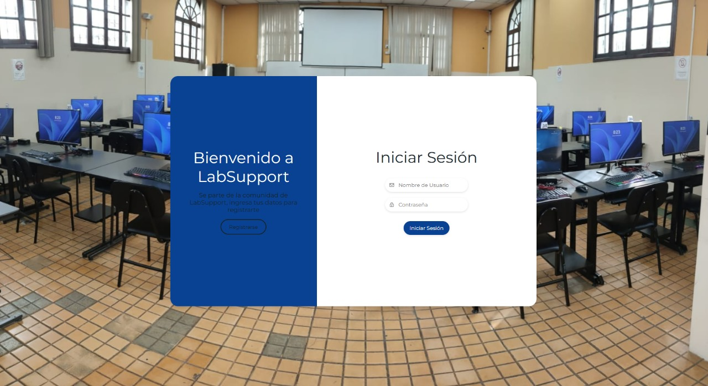
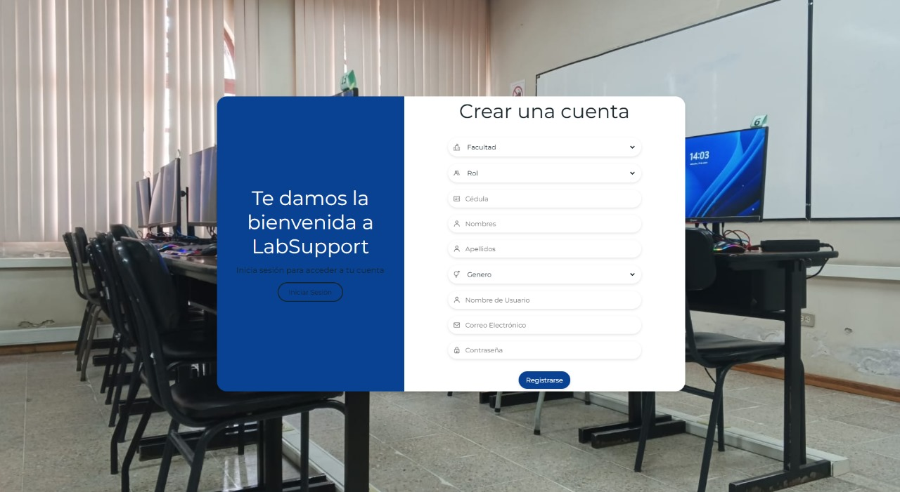
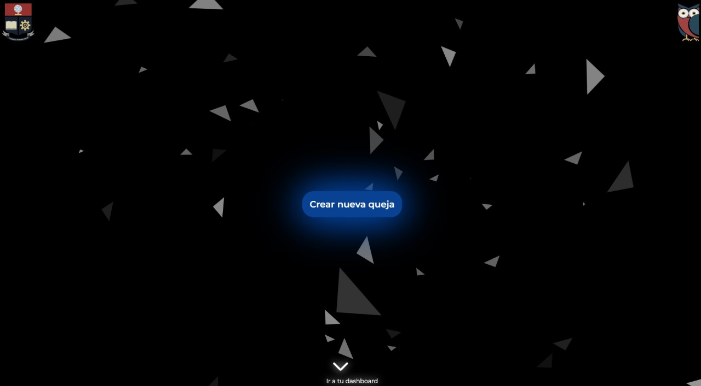
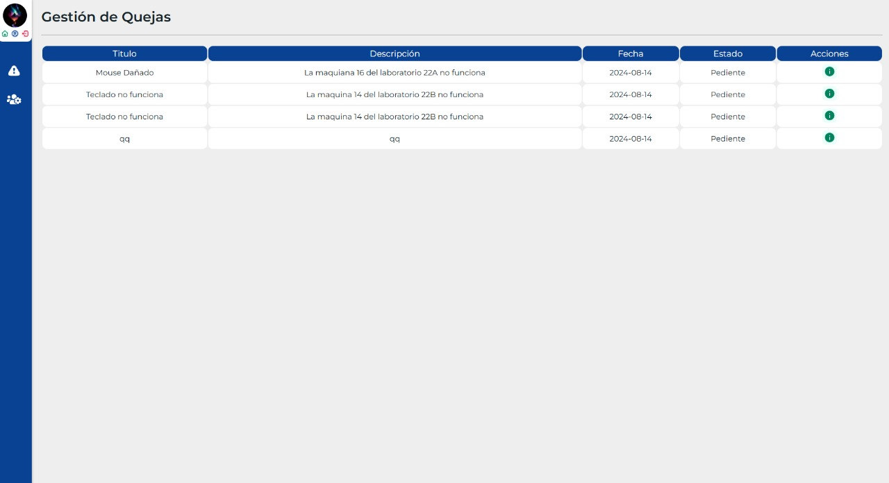
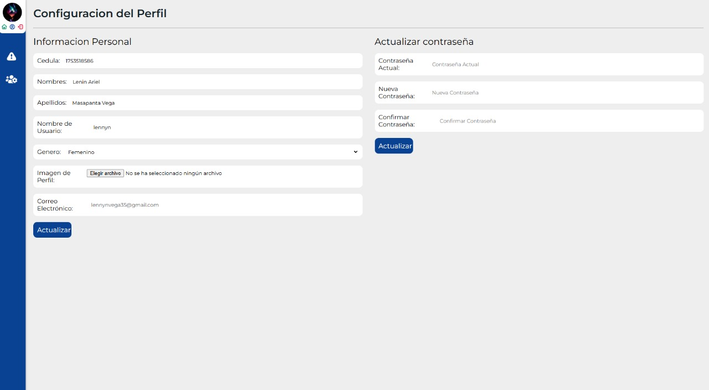

# Sistema de Gestión de Quejas en Laboratorios

## Introducción

¡Bienvenido al Sistema de Gestión de Quejas en Laboratorios! Este manual está diseñado para ayudarte a utilizar la aplicación de manera sencilla y efectiva. Aquí encontrarás instrucciones para iniciar sesión, registrar quejas, gestionar tareas y más, de acuerdo con tu rol en el sistema (estudiante, docente, pasante o administrador).

## Contenidos

1. Inicio de Sesión y Registro
2. Pantalla de Bienvenida
3. Módulo de Usuarios: Estudiantes y Docentes
4. Módulo de Pasante
5. Módulo de Administrador

## 1. Inicio de Sesión y Registro

### Pantallas de Inicio de Sesión y Registro

- **Acceso:** Desde la pantalla principal, elige "Iniciar Sesión" si ya tienes una cuenta, o "Registrarse" si eres nuevo en el sistema.
- **Iniciar Sesión:**
  - Ingresa tu correo electrónico y contraseña.
  - Haz clic en "Iniciar Sesión".
- **Registro:**
  - Completa los campos solicitados (nombre, correo, contraseña, etc.).
  - Haz clic en "Registrarse".
  - Recibirás un correo para confirmar tu cuenta.

### Consumo del Endpoint de Autenticación

- El sistema verificará tus credenciales en la base de datos.
- Si son correctas, te llevará a la Pantalla de Bienvenida.

### Creación de un Estado Global para el Usuario

- Después de iniciar sesión, tu información se almacenará en el sistema para que puedas acceder a ella desde cualquier sección de la aplicación.

## 2. Pantalla de Bienvenida

### Diseño de la Pantalla de Bienvenida

- Al iniciar sesión, serás dirigido a la pantalla de bienvenida.
- Aquí verás las opciones principales basadas en tu rol (estudiante, docente, pasante o administrador).
- Navega por el menú para acceder a las funcionalidades disponibles.

## 3. Módulo de Usuarios: Estudiantes y Docentes

### Creación y Gestión de Quejas

- **Crear Queja:**
  - Accede al menú "Quejas" y selecciona "Crear Queja".
  - Llena los detalles de la queja (descripción, categoría, etc.).
  - Haz clic en "Enviar" para registrar la queja.
- **Actualizar Queja:**
  - Ve a "Mis Quejas" y selecciona la queja a actualizar.
  - Modifica la información y guarda los cambios.

### Actualización del Perfil de Usuario

- **Actualizar Perfil:**
  - Dirígete a "Mi Perfil".
  - Actualiza tu información personal.
  - Guarda los cambios para que se actualicen en el sistema.

### Visualización de Detalles de una Queja

- **Ver Detalles de Queja:**
  - En "Mis Quejas", selecciona una queja para ver todos los detalles.

## 4. Módulo de Pasante

### Gestión de Quejas y Tareas

- **Crear Queja:**
  - Similar al módulo de usuarios, crea una queja desde la opción correspondiente.
- **Actualizar Queja:**
  - Selecciona una queja existente y realiza las modificaciones necesarias.
- **Revisar Tarea:**
  - Accede a "Tareas".
  - Selecciona una tarea para revisar su estado y detalles.
- **Actualizar Tarea:**
  - Modifica el estado de una tarea según el progreso realizado.

### Actualización del Perfil de Pasante

- **Actualizar Perfil:**
  - Actualiza tu perfil en "Mi Perfil".

**Imagen sugerida:** .

## 5. Módulo de Administrador

### Gestión de Tareas y Pasantes

- **Asignar Tarea:**
  - En "Tareas", selecciona "Asignar Tarea".
  - Completa la información y asigna la tarea a un pasante.
- **Crear Tarea:**
  - Crea nuevas tareas desde "Crear Tarea" en el menú.
- **Actualizar Tarea:**
  - Modifica tareas existentes según sea necesario.
- **Gestionar Pasantes:**
  - En "Pasantes", puedes crear un nuevo pasante o actualizar la información de uno existente.
- **Revisión y Actualización de Quejas:**
  - Los detalles de las quejas están disponibles para revisión y actualización.

## Conclusión

Este manual te guía a través de las funciones básicas del sistema. Si tienes dudas o problemas, consulta al administrador del sistema o revisa las secciones correspondientes de este manual. ¡Gracias por usar nuestro sistema y esperamos que esta guía te sea útil!
